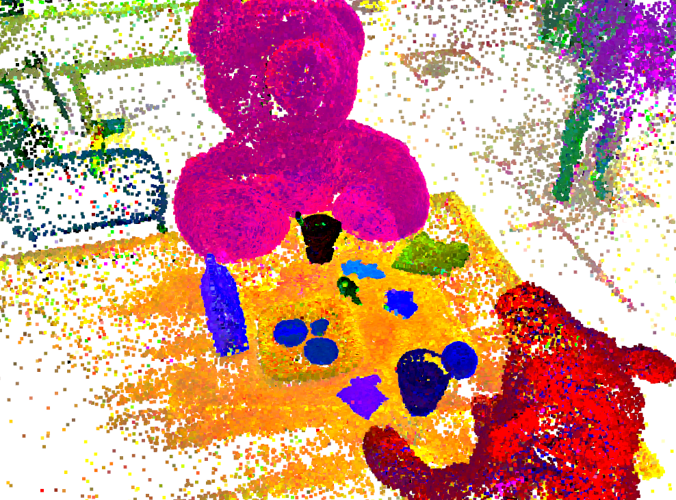
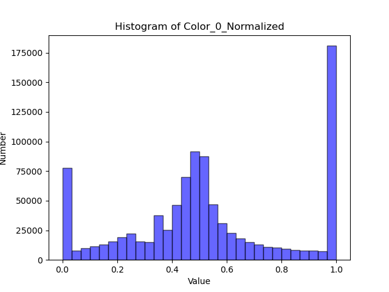

## Visualize Your LGS Model

#### Set Up

My code is built upon [LangSplat](https://github.com/minghanqin/LangSplat), so make sure you have cloned their repo and installed their dependencies.

Then run

```bash
cd LangSplat
git clone https://github.com/fflahm/lgs_vis.git
cd lgs_vis
conda activate langsplat
pip install open3d
```

#### 3D Feature Visualization

By running `vis_3d_feature.py`, you can see the 3D features of LGS model directly in an open3d viewer and save images like this:



Recommended arguments 1:

```bash
python vis_3d_feature.py -m $model_path --opac_filter --pca --outlier_filter
```

Recommended arguments 2:

```bash
python vis_3d_feature.py -m $model_path --opac_filter --decoding --ae_ckpt $ae_path
```

Arg `-m` should be the path of LGS model (like .../chkpnt30000.pth), arg `--ae_ckpt` is the path of autoencoder checkpoint (like .../best_ckpt.pth).

By setting `--load_cam` and `--cam_json` (like .../cameras.json), you can start the viewer at certain view (specified with arg `--cam_id`).

By setting `--save_path`, you can save the image at certain view.

By setting `--draw_hist`, you can generate figures like this:



#### 3D Query

[TODO]
